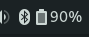

# BudgieBluetoothBattery

This is a small Panel applet for the Budgie Desktop to display the battery charge of a 
connected Bluetooth device.  
It uses the library `Bluetooth_Headset_Battery_Level` by @TheWeirdDev.



------
## Installation

With Archlinux or Manjaro, you can install this applet using AUR:

```bash
yay -S budgie-bluetooth-battery-applet
```

It is possible that you need to re-login to make the Applet visible in Budgie Settings.

------

With less cool Linux Distributions (😉) one way to get it working is to copy the following files to the paths
in which they are expected by Budgie:
```
# Local installation
mkdir -p ~/.local/share/budgie-desktop/plugins/budgie-bluetooth-battery-applet
cp BudgieBluetoothBatteryApplet.plugin budgie_bluetooth_battery_applet.py ~/.local/share/budgie-desktop/plugins/budgie-bluetooth-battery-applet/
mkdir -p ~/.local/share/glib-2.0/schemas
cp schema/de.galaxy102.budgie.bluetooth-battery.gschema.xml ~/.local/share/glib-2.0/schemas/
glib-compile-schemas ~/.local/share/glib-2.0/schemas

# System-wide installation
sudo mkdir -p /usr/lib/budgie-desktop/plugins/budgie-bluetooth-battery-applet
sudo cp BudgieBluetoothBatteryApplet.plugin budgie_bluetooth_battery_applet.py /usr/lib/budgie-desktop/plugins/budgie-bluetooth-battery-applet/
sudo cp schema/de.galaxy102.budgie.bluetooth-battery.gschema.xml /usr/share/glib-2.0/schemas/
sudo glib-compile-schemas /usr/share/glib-2.0/schemas
```

You need to Re-Login for the changes to take effect.

------

## Configuration

When adding the applet, you need to enter the MAC address of the device you want to see the battery charge of.
To find that address, go to the Bluetooth Settings and click the device.


Enter this address in the same format in Budgie Settings when adding the Applet to your Panel.

------

## Known issues

* By now, multiple Applet instances are not supported (and I have no idea how to implement that...)
* The Behaviour when the device is not connected is to show "NC" as battery state. This could be made configurable.
* The Poll interval is fixed to 30 seconds and could be made configurable.
* This is my first work with Gtk. I have no idea whether the code style is adequate.

Please feel free to open PRs or write Github Issues.

------

## Thanks

- To @TheWeirdDev for the effort with [`bluetooth-battery`](https://github.com/TheWeirdDev/Bluetooth_Headset_Battery_Level)